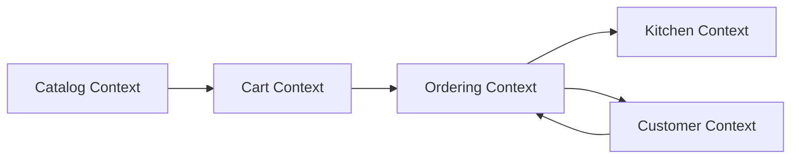
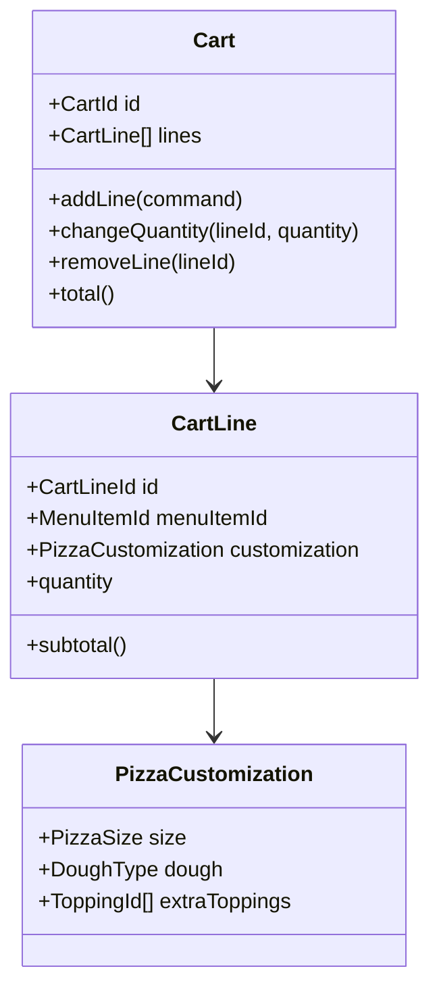
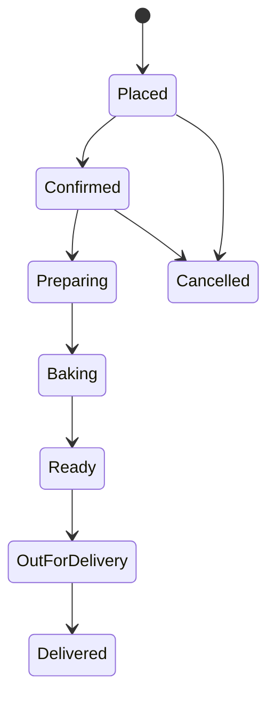
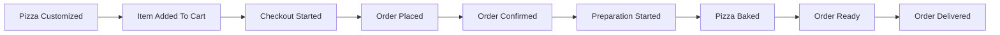

# Forno & Slice: Product And DDD Specification

## 1. Product Vision

`Forno & Slice` это веб-приложение пиццерии с пользовательской витриной и базовой внутренней зоной обработки заказов.

Цель проекта:

- дать понятный домен для изучения DDD;
- показать, как переносить bounded contexts в Angular;
- научиться проектировать frontend вокруг доменных моделей, а не вокруг страниц.

## 2. Business Scope

В первой версии система позволяет:

- просматривать каталог пицц, напитков и закусок;
- конфигурировать пиццу: размер, тесто, доп. топпинги;
- управлять корзиной;
- оформлять заказ;
- отслеживать статус заказа;
- просматривать поток заказов в зоне кухни.

## 3. Roles

- `Guest` просматривает каталог и оформляет заказ без аккаунта.
- `Customer` хранит адреса, телефон и историю заказов.
- `KitchenOperator` принимает заказ и меняет его статус.
- `DeliveryManager` отмечает заказ как переданный в доставку.

## 4. Ubiquitous Language

- `Menu Item` элемент меню, который можно купить.
- `Pizza Template` базовая пицца из каталога.
- `Customization` изменения базовой пиццы.
- `Cart` временный набор выбранных позиций.
- `Cart Line` строка корзины.
- `Order` оформленный заказ.
- `Order Line` строка заказа.
- `Money` value object для цены.
- `Address` value object для адреса доставки.
- `Order Status` жизненный этап заказа.

## 5. Functional Requirements

### 5.1 Catalog

- Пользователь видит разделы меню.
- Для каждой пиццы доступны размеры и цена по размеру.
- Часть топпингов несовместима с некоторыми типами теста.

### 5.2 Cart

- Корзина пересчитывает итоговую цену после каждого изменения.
- Две одинаково сконфигурированные пиццы должны схлопываться в одну строку с количеством.
- Изменение конфигурации должно менять identity строки корзины.

### 5.3 Ordering

- Заказ можно оформить только если есть минимум один товар.
- Для доставки нужны имя, телефон и адрес.
- После оформления заказ получает уникальный номер.

### 5.4 Kitchen Flow

- Кухня видит только активные заказы.
- Заказ проходит статусы: `Placed -> Confirmed -> Preparing -> Baking -> Ready -> OutForDelivery -> Delivered`.
- Отмена доступна только до начала приготовления.

## 6. Non-Functional Requirements

- Frontend: `Angular`.
- Архитектурный стиль: `DDD + Clean-ish layering`.
- Источник данных на старте: `Mockoon`.
- Структура должна быть удобной для постепенного перехода на реальный backend.

## 7. Bounded Contexts

### 7.1 Catalog Context

Отвечает за меню, категории, шаблоны пицц, опции и правила доступности.

### 7.2 Cart Context

Отвечает за текущее состояние пользовательской корзины и пересчет суммы.

### 7.3 Ordering Context

Отвечает за checkout, создание заказа и его жизненный цикл.

### 7.4 Customer Context

Отвечает за профиль клиента, контакты, адреса и историю заказов.

### 7.5 Kitchen Context

Отвечает за операционный список заказов и смену статусов.

## 8. Context Map

## 9. Core Domain Model

### 9.1 Main Aggregates

- `Cart` aggregate root.
- `Order` aggregate root.
- `CustomerProfile` aggregate root.

### 9.2 Entities

- `CartLine`
- `OrderLine`
- `PizzaCustomization`
- `SavedAddress`

### 9.3 Value Objects

- `Money`
- `Address`
- `PhoneNumber`
- `PizzaSize`
- `DoughType`
- `OrderStatus`

## 10. Domain Rules

1. Цена строки корзины = базовая цена позиции + цена модификаторов, умноженная на количество.
2. Нельзя добавить недоступный топпинг для выбранного типа теста.
3. Нельзя оформить пустую корзину.
4. Нельзя перевести заказ из `Ready` обратно в `Placed`.
5. Нельзя отменить заказ после статуса `Preparing`.
6. Номер заказа генерируется только при подтверждении checkout.

## 11. Aggregate Example

## 12. Order Lifecycle

## 13. Key Use Cases

### UC-01 Browse Catalog

Пользователь открывает меню, фильтрует категорию и просматривает карточки пицц.

### UC-02 Customize Pizza

Пользователь выбирает пиццу, размер, тесто и доп. ингредиенты. Система валидирует комбинацию и пересчитывает цену.

### UC-03 Add To Cart

Пользователь добавляет товар в корзину. Если конфигурация совпадает с уже существующей строкой, количество увеличивается.

### UC-04 Checkout

Пользователь вводит контактные данные. Система создает заказ и очищает корзину.

### UC-05 Update Kitchen Status

Оператор кухни переводит заказ на следующий допустимый статус.

## 14. Example Event Storming Lite

## 15. Angular Mapping Strategy

Каждый bounded context в Angular получает собственную feature-зону:

- `catalog`
- `cart`
- `ordering`
- `customer`
- `kitchen`

Внутри контекста будут слои:

- `domain`
- `application`
- `infrastructure`
- `presentation`

## 16. Suggested MVP Screens

- Home / landing.
- Catalog page.
- Pizza details / builder drawer or page.
- Cart page.
- Checkout page.
- Order tracking page.
- Kitchen board page.

## 17. Phase Boundaries

### Phase 1

Каталог, корзина, checkout.

### Phase 2

История заказов и повтор заказа.

### Phase 3

Кухонная панель и доменные события статусов.
